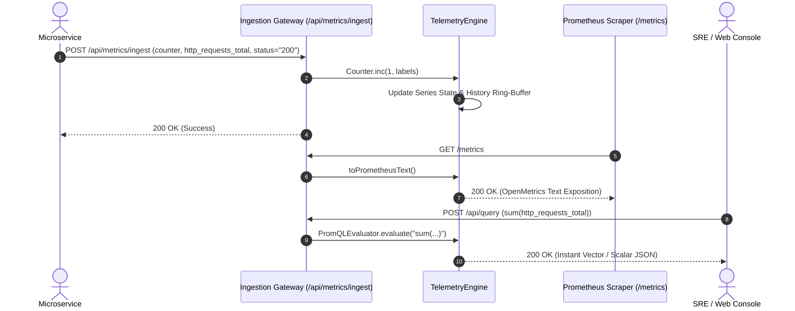

# 🏛️ System Architecture Specification: Telemetry-Pulse v2.0.0
- **Document Status:** APPROVED & COMPLETE
- **Author:** Principal Systems Architect
- **Version:** 2.0.0
- **Date:** 2026-09-20

---

## 1. Architectural Overview

`Telemetry-Pulse v2.0.0` provides an OpenTelemetry and Prometheus-compatible metric aggregation architecture.

```mermaid
flowchart TD
    Client[Microservice / Ingest Agent] -->|POST /api/metrics/ingest| Server[HTTP Server & Ingestion Gateway]
    Prometheus[Prometheus / Grafana Agent] -->|GET /metrics Scrape| Server
    Dashboard[Cyber Dark Studio / UI] <-->|SSE Stream: /api/events/stream| Server
    Dashboard -->|POST /api/query (PromQL)| Server
    
    subgraph Engine [TelemetryEngine Subsystem]
        Server --> Registry[(Metric Series Registry)]
        Registry --> Counters[Counters Map]
        Registry --> Gauges[Gauges Map]
        Registry --> Histograms[Cumulative Histograms]
        Registry --> ExpHistograms[OTel Exponential Histograms]
        
        Server --> Evaluator[PromQL Algebraic Evaluator]
        Evaluator --> Registry
        
        Server --> Exposer[OpenMetrics Text Formatter]
        Exposer --> Registry
    end
```

---

## 2. Metric Ingestion & PromQL Query Sequence



---

## 3. Data Structures & Serialization Formats

### 3.1 Prometheus / OpenMetrics Exposition Format
```text
# HELP http_requests_total Total count of HTTP requests processed by edge gateway
# TYPE http_requests_total counter
http_requests_total{env="production",method="GET",status="200"} 1240
http_requests_total{env="production",method="POST",status="201"} 84

# HELP http_request_duration_seconds HTTP latency distribution in seconds
# TYPE http_request_duration_seconds histogram
http_request_duration_seconds_bucket{handler="/api/v1/auth",le="0.005"} 1
http_request_duration_seconds_bucket{handler="/api/v1/auth",le="+Inf"} 7
http_request_duration_seconds_sum{handler="/api/v1/auth"} 2.01
http_request_duration_seconds_count{handler="/api/v1/auth"} 7
```

### 3.2 PromQL Query Response Schema
```json
{
  "status": "success",
  "data": {
    "resultType": "vector",
    "result": [
      {
        "metric": {
          "__name__": "http_requests_total",
          "env": "production",
          "status": "200"
        },
        "value": [1726819200.123, "1240"]
      }
    ]
  }
}
```

---

## 4. REST API Surface

| Method | Endpoint | Description | Status Code |
| :--- | :--- | :--- | :--- |
| `GET` | `/api/health` | Liveness and health probe | 200 OK |
| `GET` | `/api/stats` | Summary of metrics, active series, and uptime | 200 OK |
| `GET` | `/metrics` | Prometheus standard scrape endpoint | 200 OK (text/plain) |
| `POST` | `/api/metrics/ingest` | Ingest a counter, gauge, or histogram observation | 200 OK / 400 |
| `POST` | `/api/query` | Evaluate PromQL queries (`sum`, `avg`, `rate`, matchers) | 200 OK / 400 |
| `GET` | `/api/metrics/catalog`| List all registered metric descriptors | 200 OK |
| `GET` | `/api/events/stream` | Real-time Server-Sent Events (SSE) telemetry stream | 200 OK (text/event-stream) |
